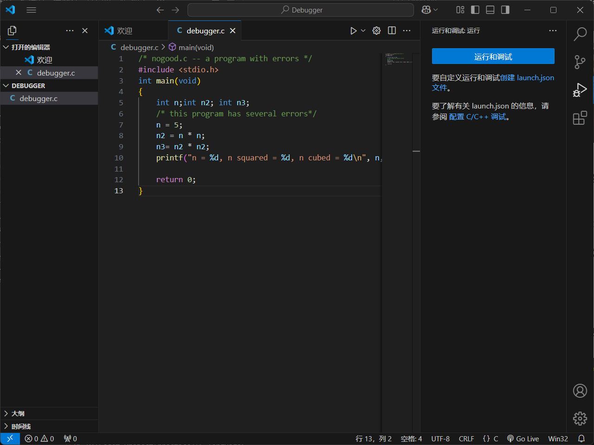
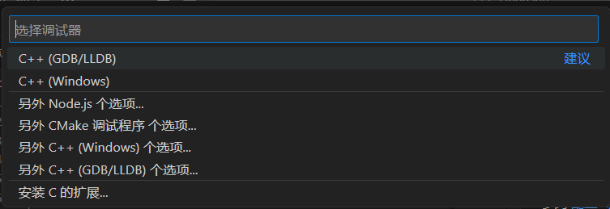
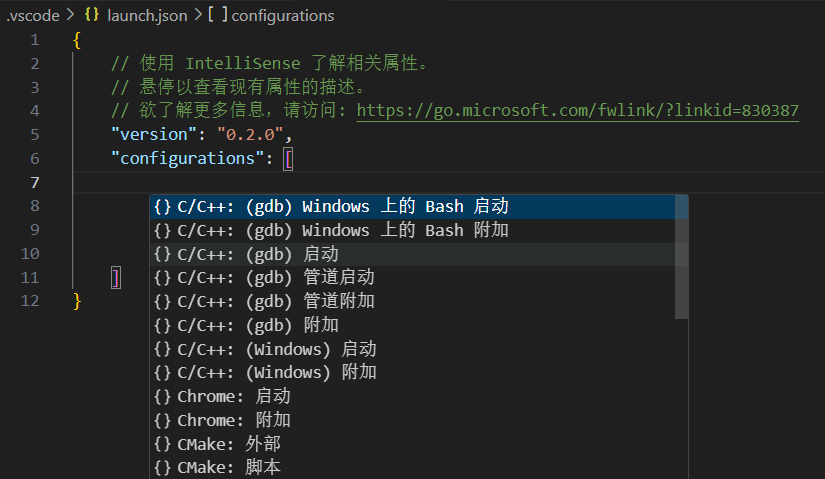

# How to use debugger?

- <b>Adding `printf()` statements everywhere 
可以直接在任何语句之间插入`printf()`函数的语句来打印你想要的值，从而来检查这些变量在程序当中的状态。

## Using Debugger(调试器)
可以使用断点调试等方式的调试器来检查变量在程序中的状态
接下来将单独展示`Vscode` C language的调试器的环境配置

接下来我们将用名为`Debugger`的空文件夹作演示
我们先创建名为`debugger.c`的文件之后再复制粘粘简单的C语言程序

输入完程序后我们鼠标点击Vscode窗口的右栏当中的运行和调试（即上从往下数第三个图标），右栏将会弹出`运行和调试`的窗口，之后我们先点击蓝字的`创建 launch.json文件`即可

然后在弹出的`选择调试器`的窗口直接选择建议的`C++ (GDB/LLDB)`即可，然后左栏的文件夹资源窗口会发现系统已经自动创建包含`launch.json`文件的`.vscode`文件夹了。

点击已经创建好的`launch.json`文件（一般系统会自动跳转到此文件），如果是自动跳转则会如下，没有或不小心点击到其他的地方则再次点击窗口下方蓝字的`添加配置`即可

然后我们直接选择`{} C/C++ (gdb) 启动`，系统会自动生成如下的代码，这时候注意看`第11行`和`第18行`


```js
第11行： "program": "输入程序名称，例如 ${workspaceFolder}/a.exe",
直接改写成
 "program": "${workspaceFolder}/output/${fileBasenameNoExtension}.exe",


第18行:  "miDebuggerPath": "/path/to/gdb",
这一行的实际意义是你调试器的路径，要根据你编译器所处的路径填写
(调试器gdb.exe在编译器文件的bin文件夹里面)
比如我的是C:\\mingw\\bin\\gdb.exe
那么直接改成
"miDebuggerPath": "C:\\mingw\\bin\\gdb.exe",
```
然后保存完后编译程序，编译完后就可以在刚才的`运行和调试`的窗口选择`gdb(启动)`进行调试了，可以先添加断点（把鼠标放到行的数字的左边会有个隐约的红点，点击即可添加断点，则在调试的时候程序会在这里暂停）
成功的话应该是这样的

